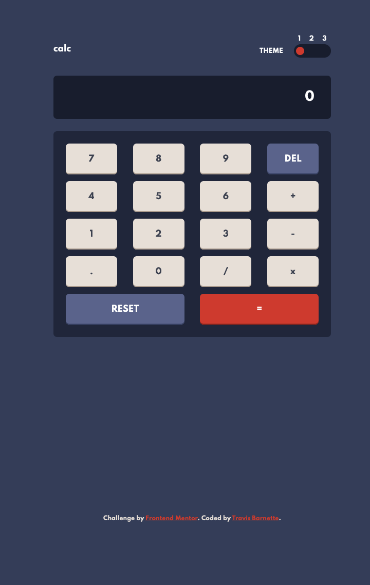

# Frontend Mentor - Calculator app solution

This is a solution to the [Calculator app challenge on Frontend Mentor](https://www.frontendmentor.io/challenges/calculator-app-9lteq5N29). Frontend Mentor challenges help you improve your coding skills by building realistic projects.

## Table of contents

- [The challenge](#the-challenge)
- [Screenshot](#screenshot)
- [Links](#links)
- [Built with](#built-with)
- [What I learned](#what-i-learned)
- [Continued development](#continued-development)
- [Useful resources](#useful-resources)
- [Author](#author)

### The challenge

Users should be able to:

- See the size of the elements adjust based on their device's screen size
- Perform mathmatical operations like addition, subtraction, multiplication, and division
- Adjust the color theme based on their preference
- **Bonus**: Have their initial theme preference checked using `prefers-color-scheme` and have any additional changes saved in the browser

### Screenshot



**Note: Delete this note and the paragraphs above when you add your screenshot. If you prefer not to add a screenshot, feel free to remove this entire section.**

### Links

- Solution URL: [https://github.com/barnettet31/calculator-app](https://github.com/barnettet31/calculator-app)
- Live Site URL: [https://barnettet31.github.io/calculator-app/](https://barnettet31.github.io/calculator-app/)

### Built with

- Semantic HTML5 markup
- CSS custom properties
- Flexbox
- CSS Grid
- Mobile-first workflow
  -Vanilla JS

### What I learned

I learned that you can assign properties to the window object and set custom setter functions to automatically update the content of an element in the dom when it is updated

To see how you can add code snippets, see below:

```js
function createBindedVariable(propertyName, targetID) {
  let newValue = 0;
  Object.defineProperty(window, propertyName, {
    set: function (value) {
      newValue = value;
      let targetRef = document.getElementById(targetID);
      targetRef.innerText = value;
    },
    get: function () {
      return newValue;
    },
  });
}
```

### Continued development

I'd like to continue to work on css variables for defining themes and modifying those themes on various slider elements like the one in this project.

### Useful resources

- [Styling Radio Buttons](https://css-tricks.com/zero-trickery-custom-radios-and-checkboxes/) - I love this site for css tips and tricks! Check them out
- [Window Properties](https://blog.bitsrc.io/demystifying-react-create-one-way-data-binding-with-vanilla-js-cd49b70ec75) - This is an amazing article which helped me finally understand window properties and updating dom elements on them. I'd recommend it to anyone still learning this concept.

## Author

- Frontend Mentor - [@barnettet31](https://www.frontendmentor.io/profile/barnettet31)
- Twitter - [@barnett_travis5](https://twitter.com/barnett_travis5)
